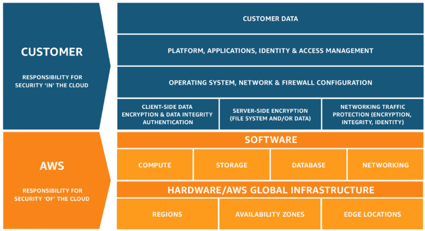

# Essay riset mengenai AWS
> Coba cari tau soal AWS, dan jelaskan apa yang kalian paham soal itu?

AWS merupakan salah satu penyedia jasa cloud computing yang menawarkan berbagai jenis service dan features seperti database, AI dan machine learning, IOT, data lakes, cloud infrastructure, dll. AWS menyediakan solusi untuk berbagai industri seperti Automotive, Aerospace, Marketing, Education, Games, dll.

## Cloud Computing
>Cloud computing is the on-demand delivery of IT resources over the Internet with pay-as-you-go pricing. Instead of buying, owning, and maintaining physical data centers and servers, you can access technology services, such as computing power, storage, and databases, on an as-needed basis from a cloud provider like Amazon Web Services (AWS).

Seperti yang tercantum di [Official Website AWS](https://aws.amazon.com/what-is-cloud-computing/?nc2=h_ql_le_int_cc) cloud computing merupakan on-demand IT resources dengan pay-as-you-go pricing sehingga pengguna cloud computing dapat menyesuaikan kebutuhan bisnisnya dengan resource secukupnya.

AWS menggunakan model shared-responsibility dimana pengguna tidak perlu merawat physical data center dan server sendiri melainkan AWS yang melakukan perbaikan jika terjadi kerusakan (infrastructure). Sebagai pengguna, kita bertanggung jawab kepada keamanan aplikasi yang dibuat (software).

## Tipe Cloud Computing
Service cloud yang disediakan AWS memiliki tiga tipe, setiap tipe cloud computing memberikan control, flexibilitas, dan manajemen yang berbeda. Berikut merupakan tipe - tipe cloud computing pada AWS:
1. **Infrastructure as a Service (IaaS)**
    
    Infrastructure as a Service (IaaS) memberikan fleksibilitas dan manajemen kontrol paling tinggi terhadap resources IT. Contoh IasS adalah **Amazon EC2**.

2. **Platform as a Service (PaaS)**

    Platform as a Service (PaaS) memberikan kemudahan pengguna untuk fokus pada deployment dan manajemen aplikasi. Hal ini dapat meningkatkan efisiensi karena pengguna tidak perlu pusing terhadap pengadaan sumber daya, perencanaan kapasitas, pemeliharaan perangkat lunak, patching, atau pekerjaan berat lainnya. Contoh PaaS adalah **AWS Lambda**.

3. **Software as a Service (SaaS)**

    Software as a Service (SaaS) memberikan produk lengkap yang di run dan di manage oleh service provider. SaaS menawarkan solusi dimana pengguna tidak perlu memikirkan bagaimana service di rawat atau bagaimana infrastruktur di kelola. Pengguna hanya perlu memikirkan bagaimana service itu akan digunakan. Contoh SaaS adalah **Amazon WorkMail**.

# Case Study
> Katakanlah kalian akan menghosting suatu website di AWS, service AWS apa saja yang akan kalian gunakan dan kenapa?

### Kebutuhan Website
Jika saya ingin menghosting suatu website di AWS, pertama-tama saya harus mencari tahu website seperti apa yang akan di host.
1. Website apa yang akan di host?

    - static website: jika website berupa static website, maka **Amazon S3** dapat digunakan untuk serve file static html, css, js tersebut.
    - dynamic website: jika website berupa dynamic website dan membutuhkan computing power, maka website dapat di host menggunakan **Amazon EC2** sebagai VPS.
    - serverless: jika website hanya berupa backend service, maka **AWS Lambda** dapat digunakan.

2. Kira-kira seberapa besar traffic pada website yang akan di host?

    Untuk website static, **Amazon S3** sangat cocok untuk berbagai jenis traffic. Website dynamic, **Amazon EC2 dengan fitur auto scaling** cukup untuk menerima traffic tinggi.

