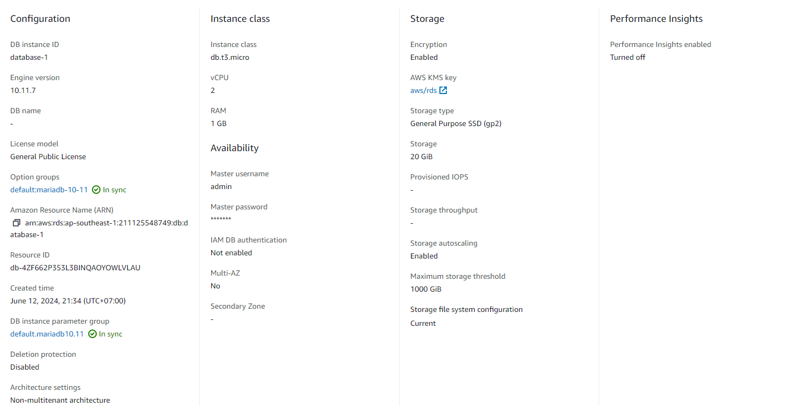
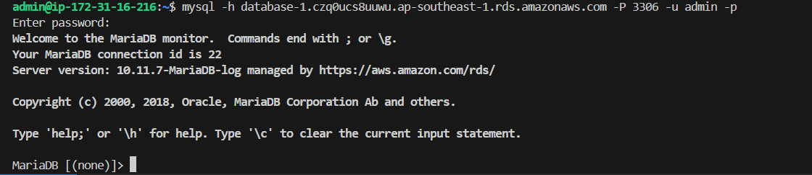
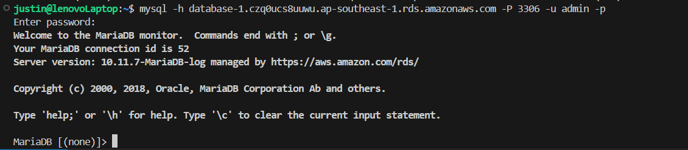

berikut ini adalah konfigurasi RDS yang sudah saya buat

Yang saya lakukan adalah membuat security group baru dengan rules inbound public ip saya sehingga saya bisa connect ke RDS instance tersebut.

berikut ini koneksi dari EC2 instances

berikut ini koneksi dari local machine saya
