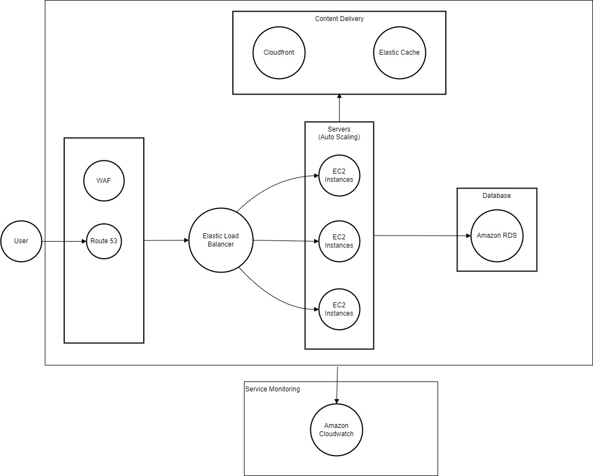

# Case Study: Scalable and E-commerce Platform Architecture Design

## Requirements:
1. Scalability: Handle varying traffic loads, particularly during peak shopping seasons.
2. Security: Protect customer data and transactions.
3. High Availability: Ensure the platform is always available to users.
4. Performance: Deliver content quickly and efficiently.

Berikut adalah diagram Scalable E-commerce platform infrastructure design menggunakan AWS services:

pertama, user melakukan request http/https dan diterima oleh route 53 untuk diarahkan ke elastic load balancer. Karena disini saya menggunakan WAF, maka route 53 akan mengirimkan request dari user menuju WAF agar dapat dilakukan filtering apakah request tersebut merupakan dari pengguna asli atau merupakan bot. Selanjutnya, request akan masuk ke elastic load balancing yang kemudian akan di kirimkan ke instance EC2 yang tersedia. Instance EC2 yang digunakan juga dilengkapi dengan auto scaling agar dapat menerima traffic yang tinggi. Kemudian untuk content delivery saya menggunakan cloudfront sebagai CDN sehingga aplikasi dapat load content secara cepat dan elastic cache untuk caching. Keperluan database saya menggunakan Amazon RDS dengan dilengkapi encryption untuk datanya. Kemudian saya juga menggunakan Amazon Cloudwatch untuk memonitoring.