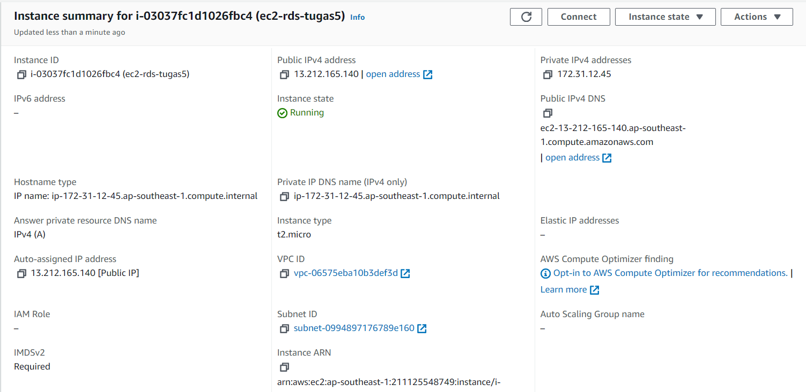
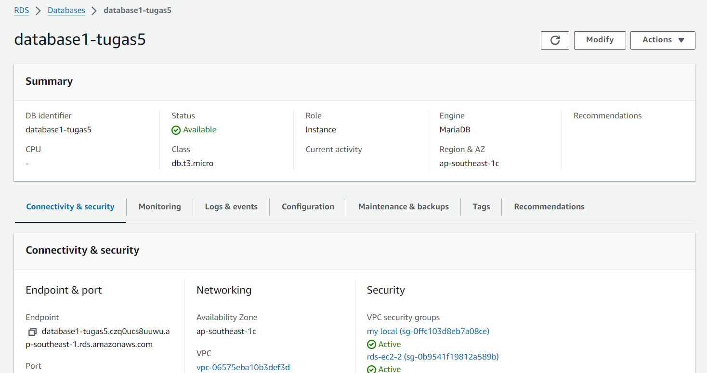
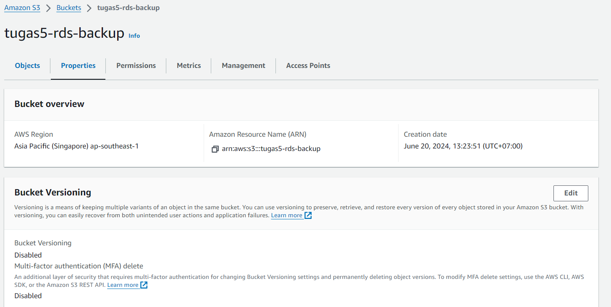
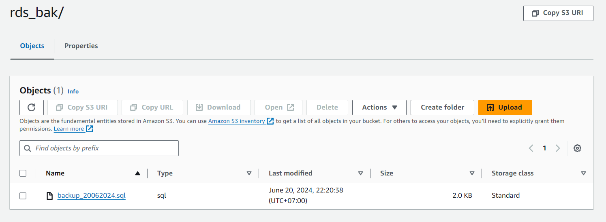

# RDS - S3 Simple Backup Script

1. Pastikan RDS dan S3 sudah tersetup
2. Buat script bash untuk melakukan backup database
    
    2.1. Lakukan mysql dump ke database RDS
    
    2.2. Rubah nama sql dump menjadi "backup_tanggal-backup.sql"
    
    2.3. Upload mysql dump tersebut ke S3 Bucket
    
    2.4. (Optional) Set lifecycle dari bucket tersebut ke hapus permanent setelah 7 hari.
3. Pengumpulan dalam bentuk PR as usual

Berikut adalah konfigurasi EC2 Instances

Berikut adalah konfigurasi RDS

Berikut adalah konfigurasi S3 bucket

setelah command dijalankan:
